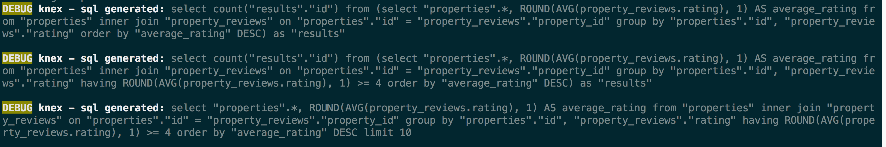

## LightBnB (fork)

This is a fork of [LHL LightBnB_WebApp](https://github.com/lighthouse-labs/LightBnB_WebApp).

#### Changes:

- Integrate [@common-web/esbuild@1.0.19](https://www.npmjs.com/package/@common-web/esbuild) for building and bundling
- Integrate [@common-web/ts-config@1.0.1](https://www.npmjs.com/package/@common-web/ts-config) for typescript 
- Moved `entry` from `index.js` to `index.ts`
- Updated the local scripts `build`, `start`, `start:watch`
- Update project structure

## Getting Started

### Development

**Start:**
```sh
yarn build && yarn start
or
npm build && npm start

// watch mode 
yarn start:watch
or
npm start:watch
```
**Testing / Linter:**

```sh
// tests 
yarn run test
// typescript typecheck
yarn lint


// Watch
yarn run test:watch
yarn lint -w
```

### Debugging 

```
// Turn on logger for sql queries generated
export KNEX_DEBUG=true
```

**Example:**



## API

### Login

```curl
curl -X POST http://localhost:3000/users/login \
-H 'Content-Type: application/json' \
-d '{"email": "", "password": ""}'
```

### Properties

**Search (price range):**

```curl
curl -X GET "http://localhost:3000/api/properties?minimum_price_per_night=100&maximum_price_per_night=300" \
-H 'Content-Type: application/json' | jq
```

**Search (min rating):**

```curl
 curl -X GET "http://localhost:3000/api/properties?minimum_rating=3.5" \
-H 'Content-Type: application/json' | jq
```

**Search (by owner_id):**

```curl
 curl -X GET http://localhost:3000/api/properties?owner_id=22 \
 -H 'Content-Type: application/json' | jq
```

**Search (by city):**
```curl
 curl -X GET "http://localhost:3000/api/properties?city=Vancouver" \
 -H 'Content-Type: application/json' | jq
```

**Add Property:**

```curl
 curl -X POST http://localhost:3000/api/properties \
 -H 'Content-Type: application/json' \
 -d '{
    "owner_id": 22,
    "title": "test",
  "description": "description",
  "thumbnail_photo_url": "http://www.google.com",
  "cover_photo_url": "http://www.google.com",
  "cost_per_night": 200,
  "street": "123 fake street",
  "city": "City",
  "province": "BC",
  "post_code": "v11 v22",
  "country": "Canada",
  "parking_spaces": 1,
  "number_of_bathrooms": 1,
  "number_of_bedrooms": 2,
  "active": true
 }' | jq
```

## Project structure

All paths are resolved relative to `src/` and is namespaced with `@app/`.

#### Example

```ts
import { Config } from '@app/types';
import { Database } from '@app/server/database';
```

#### Folders

- server (`@app/server`) - Server related code  
  - controllers (`@app/controllers`) - Any logic related to request, response  
  - services (`@app/services`) - Any business logic on top of the data beyond just accessing raw data  
  - database (`@app/database`) - Any database related logic (ie connections, data access abstractions)   
     - dao - Data Access layer logic (specific to accessing database data)  
  - routes (`@app/routes`) - Any logic related to routing
  - utils (`@app/utils`) - Any common or shared utils goes here (`utils.ts` can also be in local directory if it is specific to a certain domain)
- types (`@app/types`) - All typescript types goes here

```
├── server
│   ├── controllers
│   ├── database
│   │   └── dao
│   ├── services
│   ├── routes 
│   └── utils
└── types
```

## TODO 

- Add pagination for properties
- Add new property 
